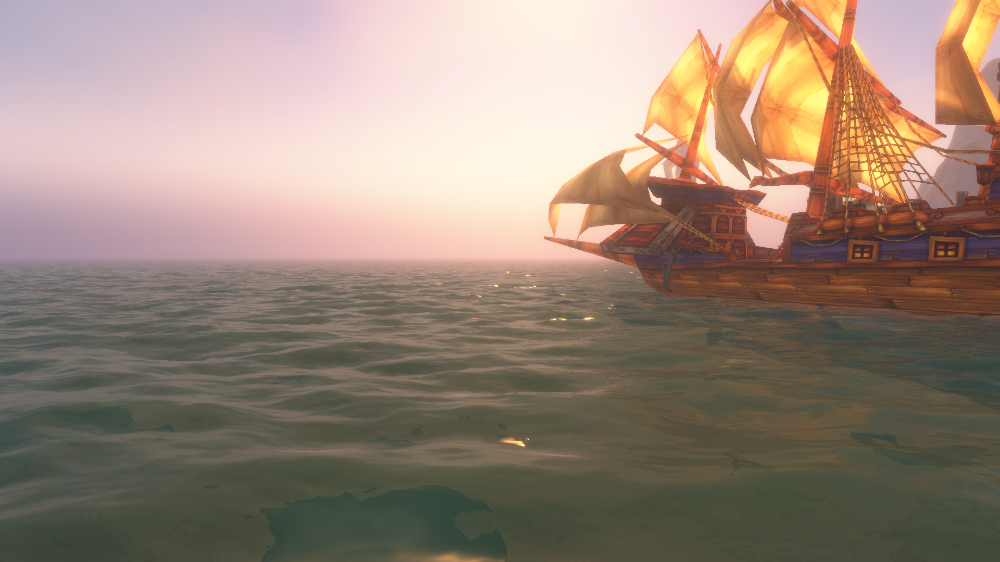
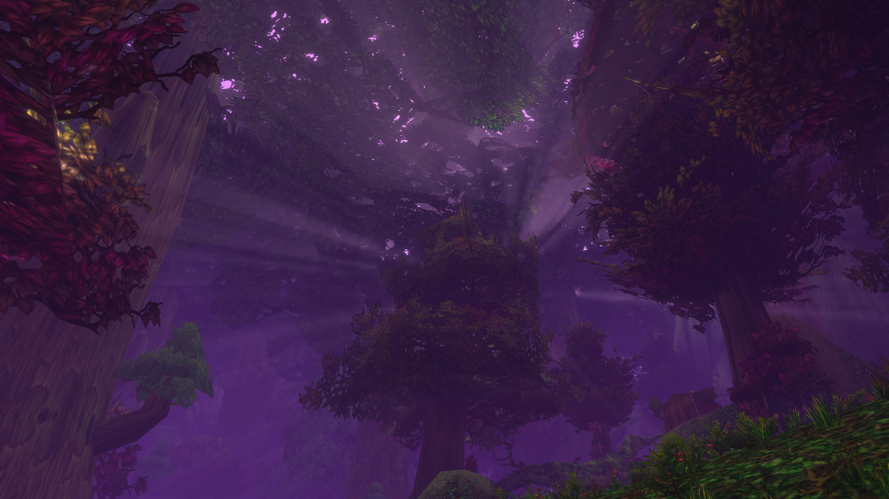

Azeroth calls us home once more, and as a long-time *World of Warcraft* player, I answered the call and bought the *Skyborne Epic Pack* that came with Beta access. And if you want the "too long, didn't read" version of it, it's pretty simple: It's good. Go play it in November.

Honestly, the decision was pretty simple - I've always been a fan of World of Warcraft's elves, and the inclusion of the Roleplay ruleset has me hoping to *finally* play a Quel'dorei (or High Elf) character in a pre-Cataclysm setting. The Warcraft Universe gets a little bit confusing about elven nomenclature, so I've tried to boil it down somewhat simply at the end of the article. I also just really like the Blood Elf models, and with the Skyborne being based off those, that decision was fairly simple. I was forking out the 225 DKK *anyway*, add in  the ~100 DKK a subscription in November would cost anyway, the real difference in cost was about ~125 DKK, 97 of which I paid with a WoW Token from my gold from mainline World of Warcraft (Retail--as it is called by the game's playerbase).

With that in mind, I won't be addressing things that are *obviously* beta jank. Like the known memory leak bugs, or the mailbox issue. Those are obviously bugs that will be ironed out before launch. 

# The Community Complaints

There really are two main complaints the community has had with regards to WoW: Forever, and both of them are a bit overblown, in my honest opinion. One is quickly addressed: The name sucks. Straight up. And sounds *miildly* dystopian.

I don't really know what name I would have preferred, but even "Old-School World of Warcraft", taking a page out of Old-School Runescape's book would have been better. It ultimately doesn't matter though, as the name can suck, but the product can still be good, and thankfully it is.

As for the *other* big complaint...

## The Skyborne

### How do they fit the narrative? 

The Skyborne certainly have proven themselves controversial, haven't they? So let's address that particular elephant in the room. Before the Beta launched, I honestly didn't really know what to think of them, other than "Oh good, we're getting Blood Elf models in Classic. That's neat." 

My next thought was: "I wonder how they're going to integrate them into the lore."

And honestly? After having played through the *High Order* variant of the starting zone (The Alliance version), I don't actually mind them. In fact, I think they're better integrated into the lore than certain *other* elven races in the game. Particularly the Void Elves and Haranir from Retail. The Void Elves themselves have very little lore other than "Oh we followed Alleria", though there's not much in the way of screentime showing people actually joining her after the Argus campaign and Void Elf unlock quest. And the Haranir occupy this weird space where they're *not* the Dark Trolls, but it is also not really exactly clarified where they are.

The Skyborne, or Shen'dorei, however, are rooted in the Highborne of Eldre'Thalas--what is now called Dire Maul. The name likely translating to somethng akin to Children of the Obscure, given the House of Shen'dralar, from which these elves originate, meaning "Those Who Remain Hidden". These elves were a group of Highborne night elves who rebelled against Prince Tortheldrin's use of demonic powers to sustain the Shen'drelar High Elves, and fled persecution. They eventually struck a pact with the wind spirits in Skywall, the Elemental Plane of Air. These spirits raised an island, Zephras Island (the Skyborne starting zone) into Skywall itself, where it has remained hidden ever since. 

These Skyborne themselves have split into two factions: The High Order, those who seek to reclaim the arts of the Arcane they used to wield back on Azeroth itself, who align themselves with the Alliance, and the Windshapers, those who wield shamanistic magics granted to them through their interactions with the wind spirits of the island. The Windshapers later align themselves with the Horde. These factions despise each other as much as the Alliance and Horde themselves do, and only reluctantly work together to fight a common foe. 

Lorewise, this is all completely sound and plausible within established lore. There's certainly nothing to say it *couldn't* have happened, which is good enough for me.

### A Retail Starting Zone Experience?

How they fit in, however, has not been the only controversy about them, however. At the end of the questing experience, you are taken to one of the pillars atop the temple controlled by the Al'Aketh cult (the faction of Skyborne antagaonistic to both High Order and Windshaper Skyborne). At this pillar, we are confronted with what is probably a future raid boss, and mages from the Kirin Tor and Shamans from the Earthen Ring (two major factions of magi and shamans respectively) together with the leader of the Skyborne in a clash. And while I'd agree, it doesn't feel *super* classic, given that Classic does tend to just have you interact with the major lore NPC and you go do things--this is likely a constraint of early World of Warcraft's engine and world persistance, more than it is what I think the original development team really wanted. It is not unlike the questline that attunes you to Onyxia's Lair where you confront Katrana Prestor to me, nor is it unlike what one could easily have seen in Wrath of the Lich King or Cataclysm to me.

And... it does feel very Cataclysm. The future model the probable future raid boss uses is from Cataclysm, after all. And the area itself is as if it was taken straight out of The Vortex Pinnacle. It doesn't help that even the music that plays during the confrontation is from Cataclysm either.

But... retail? I don't think so. I don't think most "Classic andies" have played retail in long enough to actually know how these things would go down. It's barely a confrontation, let alone a fight. You get to fight 2 guards, then the NPCs zap the other guards, the raid boss cackles, saying that Zephras Isle is doomed, and we retreat away. In Retail, unless your name is Xal'atah, and you've got *Y'shtola* levels of plot armor, the confrontation would have been a massive battle, ending with the death of the boss.

And me calling this "barely a confrontation" is not a bad thing. It grounds it more in Classic than it otherwise would have been. It's definitely taking more points out of the Death Knight starting area or Goblin/Worgen starting areas' books than it is the original races' starting areas, but I do think at a writing level, you're kind of stuck between a rock and a hard place with the Skyborne there. Your character is not a high profile character at this point in their journey. They'd have no reason to personally have contact with the respective factions. And your character has no push to leave the island if it remains obscured from the antagonist. 

This confrontation not only gives your character a reason to leave, but also gives the leaders of the Skyborne a reason to stay. Because there's still work to be done there for the leaders, but it is also clear that they need to reintegrate with the wider world. And as such, your character is given the role of envoy to make first contact with the faction you created your character to be aligned with. This is actually not unlike the Blood Elf questing experience in *The Burning Crusade*, where you're *also* sent as an envoy to the Undercity to make contact with Sylvanas, given the Blood Elves at the time new alliance with the Horde, so your character being sent as an envoy after an initial questing experience is not unheard of, even back then.

# With that addressed...

Let's talk about the meat of the game, shall we? And what a game it is. The gameplay is Classic. It's nailed that bit. I don't even feel I need a section for that. It feels good, and exactly as it should be. So let's *actually* start the first proper section with something I genuinely cannot believe I'd start with for a reboot of a 2004 game. But seriously, have you SEEN the graphics?

## The Graphics

The water looks so good! Look at how the sun is reflecting off the waves of the water! Blizzard, whoever did the lighting engine and water shader overhaul for Forever needs a raise. I don't care how much they're earning, they need a raise. As a player of both retail and classic WoW, not to mention Final Fantasy XIV, both the retail and FF14 teams should be taking note of the tech used here. It looks amazing. The same can be said for the lighting tech, and I did not spend particularly long looking for examples. The official panels did a much better example of showing zones in a much better light. Duskwood in particular should look amazing.

## The First and Last Name System

This is probably one of the highlights for me. Genuinely. I love getting into character, and having a full character name in front of me is great. It also sidesteps a lot of the issues with creating character names. I'm very picky with my character names in Retail and Classic. I want them to actually feel like believeable names. The problem with that is, many players also want that. So realistic character names go very, very quickly. Especially on RP servers. This sidesteps most of that issue entirely. It's not often that you'll be dead-set on exactly one first *and* last name combo. The only even remote downside I can think of for this is names needing to be unique for the entire region now. ~~There's also one potential issue I'm not sure the developers are aware of (I did file a bug report, though!), and that is the SavedVariables folders only having character first names. So this would mean, say we have a mage character called Jaina Proudmoore. The character folder in the WTF folder would only be called "Jaina". This would mean that any character on your account with the first name "Jaina" would reuse addon settings from that character, even if the last name is different. In this particular example, say we also have a Warlock character named Jaina Fauxmoore. It would also retain the settings from the mage, even if that might not be super desirable.~~

Update 25th September 2026: This seems to have been addressed in last night's Beta build, such that characters now follow a firstName-lastName pattern in the WTF folder, alleviating the issue.

## The Rulesets/Megaservers

This one is a bit of a mixed bag for me. World of Warcraft: Forever reintroduces the rulesets we're familiar with from traditional realms: Normal, PvP and RP at launch, with Hardcore coming a little down the line. I would also have liked a RP-PvP ruleset, but I think that might be a little too niche to spin up a ruleset for.

I'm glad we're actually getting a roleplay ruleset, especially after Classic anniversary *not* having RP servers. On the other hand, it does also come with a massive caveat for PvP enjoyers. And I do enjoy myself a bit of World PvP. But I also like to play on both factions, and that just isn't possible on the PvP ruleset in Classic. Not without buying multiple accounts. Yes, there was such a restriction in the original 2004 release. And in the 2019 rerelease. And the restriction was there with the megaservers in Classic Anniversary too. But Anniversary and Forever have two big differences from the original releases: There's only one designated place for PvP players to go. In 2004 and 2019 you could play both factions in PvP on the same account simply by switching realms. You can't do that in a one-realm (or realmless) system. 

Even the 2004 release and Classic 2019 didn't maintain this restriction for a long time, with it being lifted with the release of Wrath of the Lich King in 2008, and the final patch of The Burning Crusade Classic respectively. Most (but not all) Classic players can agree that Cataclysm does not feel classic to them, and most can concede that Wrath is still somewhat Classic. I think given the changes to the server infrastructure and the way servers are handled in modern Classic, bringing in this change from Wrath of the Lich King would probably be for the best.

On top of this, Skyborne can communicate cross faction by speaking Darnassian anyhow. The primary justification for this restriction, as far as I'm aware, is to prevent toxicity. With the server infrastructure being as it is, and the language barrier being more of a language membrane, I feel game has evolved beyond this restriction.

Another downside is the fact that despite going realmless, we're still not going regionless. I would love to be able to play WoW with my friends across the pond without either of us having to pay for a separate subscription fee. I don't even mind having to level a separate character on those regions, or my collections (for retail) not transferring over, but the separate subscription fee does sting.

## Professions

I have, for the first time in my life, willingly skilled up Fishing in a MMO. My fishing skill in retail never goes beyond the first 15 skill points for the expansion or so, and my Fisher job in Final Fantasy XIV is probably my lowest level Disciple of the Hand/Land job. I don't really like MMO fishing. It's not like World of Warcraft has done anything unique with Fishing itself this time around, no. It's what surrounds it.

The professions feel much more well-integrated and worth levelling compared to regular Classic, and the new campfire system that interacts with it is awesome. I won't lie, part of the reason I levelled Fishing was for the "Fish Bowl" crafted item which gives a Blessing of Kings-style buff (which increases all main stats by 8%), but it also integrates very well with the Cooking profession, which itself has received a major overhaul, which suddenly makes Fishing feel worth levelling to me.

And the primary professions? They are actually worth doing while you're levelling your character to 60. The gear is genuinely very useful, and you can make crafted blues as early as level 10, though admittedly they don't come cheap given the materials required to craft them.

## World Buffs are dead!

That's it. That's the headline. And thank god for that. That meta sucked. They weren't exciting. They were stat bumps that you needed to travel all over the world to get, only to Chronoboon them because the alternative to the Chronoboon existing would be to log out after having farmed world buffs and simply not play the character until raid. Not that the process of getting them was fun in the first place. It was just a chore.

## The things it *did* take from Retail

### The User Interface

If there's one place where you can rightly call this game retail, it's the user interface. It is the Dragonflight UI overhaul, with the Midnight Addon API. This is good and bad. While the interface has been modified a bit to recreate the general elements of the original UI, it does still have a bit of a retail feel to it. I do like the bronze tint the general UI has to it. 

Most of the elements taken from retail are toggleable, but the core UI design distinctly isn't. The spellbook is very reminiscent of the spellbook from The War Within onwards, there is a Cataclysm-esque professions pane (which is probably a good thing - professions used to clutter up your general tab in Classic), the Talent tree UI itself is a mix between Cataclysm's style and the modern Dragonflight one, taking more inspiration from Cataclysm, but also making it so that you have to apply talent changes, which is partially good, partially bad. Prevents you from accidentally clicking a talent and spending a point, but it also comes with the downside of having to apply all your talents at once.

The game also brings over the Ping system from retail (likely inspired by League of Legends), which is very helpful for communicating information in a split second. Good addition to the game.

### The Quest Tracker and Map

The quest tracker on the side is the modern one from retail, though with one major difference: You can turn the quest area helper (originally introduced in Wrath of the Lich King) on or off, such that if you really prefer a Questie-less experience, you can get that just fine. The map interface is the one introduced in Warlords of Draenor and enables you to zoom in and out on the map natively. The map also has the functionality to share map pin locations in chat with others, allowing you to easily share coordinates or link a location to others in chat without hoping the other player has TomTom installed so you can share a /way command.

### HD Character Models & Transmogrification

Personally, I'm in favor of both of these changes, though not all players are. And that's probably also why they're toggleable. If you want the HD character models, you can choose to see them, and if you don't, you can choose not to. There are some caveats here, though. Skyborne, being a new race, do not have a set of SD models, so these will permanently be HD. There are also somet caveats with animations. Notably, the characters eyes opening and closing on SD models seem to have actual eyelids, where on the original, they felt more like a simple toggle. Certain character customization features from HD models have also been backported to the SD models. Especially skin colours, and for example, decoupling facial tattoo colours from hair colour on Night Elves.

On the character select screen, the race icons also use the HD versions which feel like screenshots of the models themselves, and honestly, the old artwork versions had more soul, if you ask me. 

As for transmogrification, this is purely a good change. This can be toggled on or off. This does mean that if you've decided to transmog your character, not everyone will see it. And honestly, that's fine with me. I've yet to experiment around with the transmog system as it is in Classic, but from looking at screenshots of the UI, it has brought in the excellent system from Midnight. I do wonder how much of a gold sink it is gonna be, though...

# What I haven't experienced much yet

The beta is capped at level 20, and I haven't really levelled past 15 or so at the moment, this means there's very limited testability to class feel, but so far, they feel pretty Classic. There has been a general overhaul of racial abilities in the game though, which is very likely going to shift things up in terms of race/class combo metas. Not that I personally pay much creed to the race/class combo metas. Classic (and content designed in the Classic style) isn't exactly designed to push players to their absolute limits anyhow.

# In Conclusion

I'm very much looking forward to playing the full version of the game in November. Like really. If it wasn't for the fact that I've also got studies to take care of during that time, I probably wouldn't be doing much else for a while. And even then, I will still probably be playing on both the RP and PvP rulesets, and I'd recommend anyone who's interested in WoW - even if they're only interested in playing a few certain races only available in retail, to give it a shot. The game is that good.

See you all in november!

# So what elven factions are there in WoW anyway?

There are many elven factions in World of Warcraft, all of them ending in the suffix -'dorei with the apostrophe. The Kaldorei--the Night Elves being in the exception. The suffix "dorei" essentially means "Children of" or "People" in Darnassian--the language of the Night Elves, as well as any languages derived from Darnassian. Darnassian as a term for the language itself is likely a new coinage, given Darnassus being a fairly recent city in the Warcraft universe, and is probably moreso an out of universe term than an in-universe term.

World of Warcraft currently have the following elven races:

* The Kaldorei, meaning Children of the Stars in Darnassian, being the night elves.
* The Quel'dorei, meaning Highborne, or Children of Noble Birth, being the magically gifted night elves, and nobility prior to the Sundering (the event that formed the modern map of Azeroth)
* The *other* Quel'dorei, the High Elves, being the elves that were exiled after the Sundering and sailed east to form Quel'Thalas in the Eastern Kingdoms. In modern terminology, this specifically refers to the elves that rejected Prince Kael'thas and attempted to cope without a magical font of power after the destruction of the Sunwell. These elves generally remain aligned with the Alliance.
* The Sin'dorei, meaning Children of the Blood, or the Blood Elves are Quel'dorei that followed Prince Kael'thas after the Third War (Warcraft 3), until it was revealed that Prince Kael'thas had turned traitor. Kael'thas renamed the people to the Blood Elves in honor of those who fell during the Scourge's invasion of Quel'Thalas. These elves generally (but not always) align with the Horde.
* The Ren'dorei, meaning Children of the Void, or Void Elves, are Blood Elves who sarted practicing in the void sometime around the reappearance of Alleria Windrunner during the Argus campaign. They were exiled after the reignited Sunwell reacted to Alleria's presence on the Isle of Quel'Danas, nearly turning to void on its own at that moment. These elves hace since realigned themselves with the Alliance.
* The Shal'dorei, or Nightborne, were elves who shielded themselves inside the city of Suramar during the War of the Ancients. After the Sundering, Suramar itself on what became the Broken Isles, and had shielded themselves away with their own magical font of power, the Nightwell, since that time. They were aligned with the Burning Legion in the third invasion of the Burning Legion (the expansion named Legion). After the defeat of Queen Elisande and Gul'dan at the Nighthold, they chose to align with the Horde. 
* Although I do not know entirely where to include them, the Haranir also fit in somewhere along this tree. Where the Haranir fit is a little bit of a mess, and is worth an entire article on its own, to the point where the [Warcraft Wiki page on the Haranir](https://warcraft.wiki.gg/wiki/Haranir), which is otherwise a great resource for World of Warcraft lore, contradicts itself several times on where they fit in the timeline.

And finally, the Shen'dorei. The Skyborne, who you read about earlier.